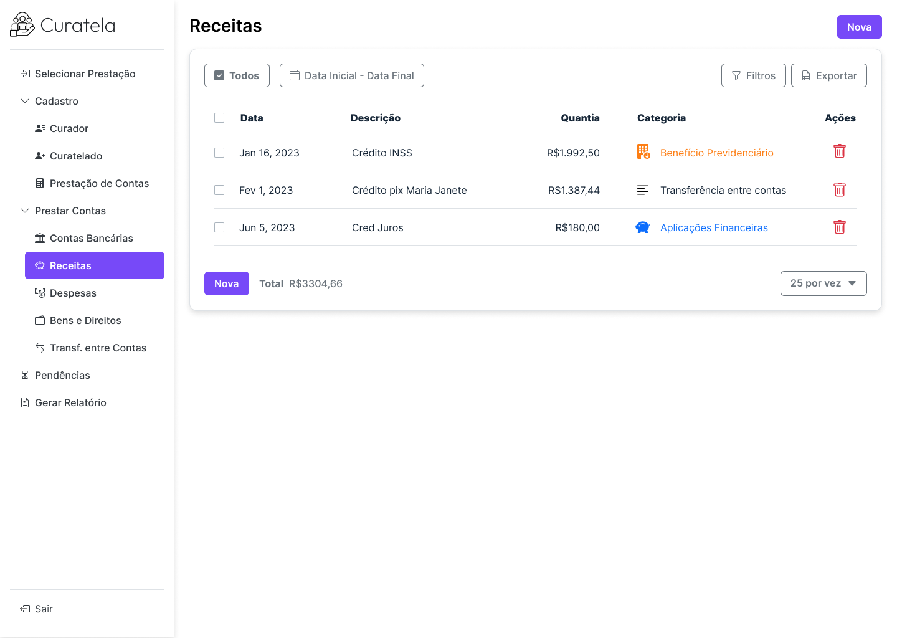

# Curatela — prestação de contas em tutela e curatela



> **In English, briefly.** When a court appoints someone to manage another
> person's affairs (a guardianship, *curatela* in Brazilian law), the guardian
> must periodically file an accounting with the judge: every cent in, every cent
> out, each one backed by a receipt. This is a web app for producing that filing —
> Angular 16 on the front, FastAPI on the back, Oracle underneath, three Docker
> containers. One vertical slice is finished end to end (income entries with file
> attachments); the remaining screens are scaffolded against a data model that
> already covers them. The part worth reading is the attachment pipeline: files
> are validated by actually parsing them, re-encoded, hashed, and stored under a
> name the uploader never chooses.

Aplicação web para montar a prestação de contas que um curador precisa entregar
ao juízo: lançar receitas, despesas, contas bancárias e bens do curatelado,
anexar os comprovantes de cada lançamento e fechar o período.

---

## Contexto: por que isto existe

Quando alguém não consegue mais administrar a própria vida civil, a justiça
nomeia um **curador** para fazer isso em seu lugar. Em troca, o curador presta
contas: periodicamente ele apresenta ao juiz um demonstrativo de tudo o que
entrou e tudo o que saiu do patrimônio do **curatelado**, com comprovante para
cada lançamento.

Na prática isso costuma ser feito em planilha, e o resultado tem os problemas de
uma planilha: comprovante que se perde do lançamento, saldo que não fecha,
categoria que muda de nome no meio do ano, e nenhuma trilha de quem mexeu no quê.

O sistema troca a planilha por um modelo em que o comprovante é parte do
lançamento — não um anexo de e-mail à parte — e em que as categorias são tabela,
não texto livre.

O domínio impõe duas coisas que moldaram o projeto inteiro:

1. **O anexo é prova.** Um lançamento sem comprovante não vale, e um comprovante
   que possa ter sido trocado depois vale menos ainda.
2. **A prestação é fechada por período.** Os lançamentos pertencem a uma
   *prestação*, que pertence a um par curador/curatelado. Nada é lançado solto.

## A decisão mais importante: como o anexo é recebido e guardado

Todo lançamento pode levar comprovantes — foto do recibo, extrato em PDF. É o
ponto onde o sistema recebe arquivo de fora, e portanto onde ele mais pode se
machucar. O caminho escolhido ([`backend/app/dependencies.py`][dep] e
[`backend/app/routes/receita.py`][rec]) tem quatro passos, e cada um responde a
uma coisa que dá errado:

| Passo | O que faz | Por quê |
|---|---|---|
| **Valida abrindo** | Pillow `Image.verify()` para imagem, `PyPDF2.PdfReader()` para PDF | Extensão e `Content-Type` são declarados pelo cliente; qualquer um pode mentir. A única verificação que vale é tentar interpretar o arquivo como aquilo que ele diz ser. |
| **Recomprime a imagem** | Reencoda para JPEG com `quality=75` | Além de cortar o tamanho, o reencode descarta o que veio junto: metadados EXIF (que carregam geolocalização) e qualquer payload escondido em segmento do arquivo original. |
| **Nomeia pelo id do banco** | A linha é inserida primeiro, e o arquivo é gravado em `/anexos/receitas/<id>` | O nome no disco nunca vem do usuário — não há travessia de diretório possível. O nome que o usuário escolheu fica numa coluna, sanitizado, só para exibir de volta. |
| **Guarda o SHA-256** | O hash do conteúdo gravado vai para a mesma linha | É o que permite dizer, depois, que o comprovante é o mesmo que foi entregue. |

Os limites são diferentes por tipo — 20 MB para imagem, 5 MB para PDF — porque
foto de celular é grande por natureza e PDF de extrato não deveria ser.

### E quando não existe comprovante

Existe recebimento sem papel — dinheiro em mãos, transferência que o banco não
detalha. Bloquear o lançamento faria o curador mentir no valor ou lançar em outra
categoria, que é pior do que não ter o recibo. Bloquear nada faria o anexo virar
opcional na prática.

A saída foi um terceiro estado: o lançamento sem anexo **exige uma
justificativa** escrita (`receita.justificativa`, até 1024 caracteres), e a
interface não deixa salvar com o campo vazio. O demonstrativo continua fechando,
e a ausência do comprovante fica registrada como ausência — com o motivo ao lado,
onde o juízo consegue ler.

### O detalhe que custou caro

`Image.open()` e `PdfReader()` **consomem o ponteiro do arquivo**. Validar o
upload na dependência e depois tentar gravá-lo na rota grava zero byte, sem erro
nenhum: o arquivo simplesmente fica vazio. O comentário sobre isso continua no
código, em `dependencies.py`, porque é o tipo de armadilha que se reencontra.

### Alternativas descartadas

- **Guardar o arquivo como BLOB no Oracle.** Simplifica o backup (um só) e o
  transacional (ou o lançamento e o anexo entram, ou nenhum dos dois). Descartado
  pelo custo de trafegar binário pelo driver a cada leitura de tela, e por deixar
  o dump do banco impraticável de mover.
- **Confiar no `Content-Type` do upload.** Uma linha em vez de vinte, e errada.
- **Guardar o arquivo com o nome que o usuário mandou.** É o caminho curto para
  `../../etc/algo` e para dois arquivos diferentes se sobrescreverem.

## Autenticação

JWT assinado com HS256 ([`backend/app/routes/auth.py`][auth]), em dois tokens:

- **access token**, 60 minutos, guardado no navegador;
- **refresh token**, 7 dias, guardado na tabela `sessao` — no servidor, não no
  cliente.

Duas escolhas menos óbvias:

- **Logout invalida de verdade.** JWT é auto-contido: um token assinado vale até
  expirar, mesmo depois do logout. Para que "sair" signifique alguma coisa, o
  token sai de circulação numa tabela `sessao_blacklist`, consultada em toda
  validação. Isso troca a principal vantagem do JWT (não precisar tocar no banco
  para validar) por uma garantia que o domínio exige.
- **Uma sessão por usuário.** O login apaga a sessão anterior antes de criar a
  nova. Dois navegadores não ficam ativos ao mesmo tempo.

O fluxo de refresh está implementado no backend e **ainda não é usado pelo
frontend** — o token expirando ainda leva o usuário de volta ao login.

> ⚠️ **Nem toda rota usa isso.** Convivem no código duas dependências de token,
> e só uma valida: `get_current_user` decodifica a assinatura e consulta a
> blacklist; `get_token_header` apenas devolve o cabeçalho recebido, sem
> verificar nada. As rotas de `user`, `curador`, `curatelado` e `prestacao` usam
> a primeira; as 8 rotas de `receita` usam a segunda, e portanto **não estão
> protegidas**. Está listado em *Limitações conhecidas* porque é o que é: uma
> dependência de andaime que ficou.

## O que está pronto e o que não está

O projeto tem uma **fatia vertical completa** — Receitas — e o resto montado em
volta dela.

| Tela | Estado |
|---|---|
| Login, cadastro de usuário | Implementada |
| Cadastro de curador e de curatelado | Implementada |
| Cadastro e seleção de prestação (endereço, residentes) | Implementada |
| Tutorial guiado (passos 1 a 5) | Implementada |
| **Receitas** (listagem, filtro, CRUD, anexos) | **Implementada** |
| Despesas, Contas bancárias, Bens e direitos, Transferência entre contas, Pendências, Gerar relatório, Tela inicial | **Placeholder** (`app-pagina-em-desenvolvimento`) |

As telas em placeholder já têm rota, item de menu e — o que importa mais —
**tabela no banco**: `despesa`, `conta_bancaria`, `patrimonio` e seus anexos e
categorias existem no esquema desde o início. O trabalho que falta nelas é
repetir, para cada uma, o que Receitas já resolveu.

## Arquitetura

Três containers, um `compose` por ambiente:

```
frontend            backend             database
Angular 16     →    FastAPI        →    Oracle 12c
:4200 (dev)         :8000               :1521
nginx :80 (prod)    uvicorn             ORCLPDB1
```

O `compose` amarra a ordem de subida no *healthcheck*, não em `depends_on` seco:
o backend só sobe quando o Oracle responde, e o frontend só quando `/health` do
backend responde. Sem isso a primeira subida falha sempre — o Oracle 12c leva
minutos para ficar pronto na primeira vez, e é por isso que o `start_period` do
banco é de 10 minutos.

| Camada | Principais dependências |
|---|---|
| Frontend | Angular 16.2.10, Bootstrap 5.3.2, ng-bootstrap 15.1.2, Node 18.18.0 |
| Backend | Python 3.11.8, FastAPI 0.110.0, SQLAlchemy 2.0.28, cx_Oracle 8.3.0, python-jose, passlib/bcrypt, Pillow, PyPDF2 |
| Banco | Oracle Database 12.1.0.2 EE, 23 tabelas |

Documentação mais detalhada dos endpoints em [`docs/back_end.md`](docs/back_end.md);
o levantamento de requisitos de cada tela, em [`docs/requisitos.md`](docs/requisitos.md).

## Como rodar

**Pré-requisitos.** Docker com Compose, e duas coisas que não estão no
repositório por não serem redistribuíveis:

1. **Os RPMs do Oracle Instant Client** (`basic` e `sqlplus`, Linux x86-64), em
   `backend/docker/development/`. Instruções e nomes exatos em
   [`backend/docker/development/README.md`](backend/docker/development/README.md).
2. **A imagem `oracle/database:12.1.0.2-ee`**, que não está no Docker Hub — ela é
   construída a partir do repositório
   [oracle/docker-images](https://github.com/oracle/docker-images).

**Configuração.** Copie os exemplos e preencha:

```bash
cp backend/.env/development/env.example  backend/.env/development/env
cp frontend/.env/development/env.example frontend/.env/development/env
```

O `env` (sem extensão) é ignorado pelo git — é ele que o `compose` carrega.
Gere uma `JWT_SECRET_KEY` própria, por exemplo com `openssl rand -hex 32`, e
use em `ORACLE_PASSWORD` a mesma senha que está em
`database/setup/01_createDev.sql`.

**Subir:**

```bash
docker compose -f compose-development.yaml up --build
```

| Serviço | URL |
|---|---|
| Frontend | <http://localhost:4200> |
| API (Swagger) | <http://localhost:8000/docs> |

Na primeira subida o Oracle demora — o `healthcheck` segura o resto até ele
responder.

**Dados de exemplo.** `POST /dev/populate_database` popula o banco com ~100
usuários e lançamentos gerados por [Faker](https://faker.readthedocs.io/) em
português. Nenhum dado real acompanha este repositório.

## Modelo de dados

23 tabelas em [`backend/app/db_schema.py`](backend/app/db_schema.py), em quatro grupos:

- **Pessoas e acesso** — `usuario`, `curador`, `curatelado`, `sessao`, `sessao_blacklist`
- **A prestação** — `prestacao`, `residente`, `prestacao_anexo`, `prestacao_anexo_tipo`
- **Movimento** — `receita`, `despesa`, `conta_bancaria` e, para cada um, uma
  tabela `_categoria` e uma `_anexo`
- **Patrimônio** — `patrimonio`, `patrimonio_tipo`, `patrimonio_categoria`,
  `patrimonio_anexo`, `instituicao_financeira`

O padrão se repete de propósito: **toda entidade de movimento tem categoria em
tabela e anexo em tabela**. Categoria como texto livre inviabiliza o
demonstrativo — é o relatório que precisa somar por categoria, e ele não pode
somar grafias diferentes da mesma coisa.

## Detalhes do frontend que valem a leitura

- **`FormStorageDirective`** ([`shared/form-storage.directive.ts`][fsd]) — uma
  diretiva que persiste qualquer `formGroup` marcado, reconstruindo inclusive
  `FormArray` aninhado a partir do `localStorage`. Existe porque o cadastro da
  prestação é longo e recarregar a página não pode custar o formulário inteiro.
- **Máscaras como diretiva, não como biblioteca** — CPF/CNPJ (que troca de
  máscara sozinha conforme o comprimento digitado), CEP e moeda.
- **CEP preenche o endereço** via [ViaCEP](https://viacep.com.br).
- **CPF/CNPJ é `string`, não número** — para não perder zero à esquerda.

## Limitações conhecidas

- **CORS aberto.** `allow_origins` inclui `'*'` **e** `allow_credentials=True`
  ([`backend/main.py`](backend/main.py)). Serve para desenvolver com o frontend
  em qualquer porta; não pode ir para produção assim.
- **As rotas de `receita` não verificam o token.** Elas dependem de
  `get_token_header`, que devolve o cabeçalho sem validá-lo (ver *Autenticação*).
  Trocar por `get_current_user`, como nas demais, é uma linha por rota.
- **A rota `/dev` é registrada sempre e não pede autenticação.** Além de
  `populate_database`, ela expõe `recreate_db` e `drop_all_brute_force` — que
  apagam o banco. O router é incluído em `main.py` sem condição de ambiente e
  sobe também pelo `compose-production.yaml`. É o item mais grave desta lista.
- **O backend de produção roda com `--reload`.** Os dois `Dockerfile` só diferem
  no caminho dos RPMs.
- **`compose-production.yaml` não é um ambiente de produção.** Ele troca o
  Angular dev server por um build servido em nginx e muda a porta; o resto é o
  mesmo, e a senha do banco continua literal no arquivo.
- **Dados sensíveis no `localStorage`.** O token de acesso e os rascunhos de
  formulário (via `FormStorageDirective`) ficam no navegador. Num domínio com
  dado financeiro de terceiro, isso merece revisão.
- **Sem testes automatizados.** Os 34 arquivos `.spec.ts` são o esqueleto gerado
  pelo Angular CLI (`should create`); o backend não tem suíte.
- **Sem migrações.** O esquema nasce dos scripts em `database/setup/` e do
  `db_schema.py`; não há Alembic nem versionamento de banco.
- **Refresh token não usado pelo frontend** (ver *Autenticação*).

## Estrutura

```
.
├── backend/                 FastAPI
│   ├── app/
│   │   ├── db_schema.py     as 23 tabelas (SQLAlchemy)
│   │   ├── dependencies.py  validação de upload e do token
│   │   ├── models/          schemas Pydantic
│   │   └── routes/          auth, user, curador, curatelado, prestacao, receita, dev
│   ├── docker/              Dockerfile por ambiente (+ onde pôr os RPMs)
│   └── main.py
├── frontend/                Angular 16
│   ├── src/app/             uma pasta por tela + shared/
│   └── docker/              dev (ng serve) e prod (build + nginx)
├── database/setup/          criação do usuário e do esquema
├── docs/                    requisitos, documentação de backend e frontend
├── compose-development.yaml
└── compose-production.yaml
```

## Licença

[MIT](LICENSE).

[dep]: backend/app/dependencies.py
[rec]: backend/app/routes/receita.py
[auth]: backend/app/routes/auth.py
[fsd]: frontend/src/app/shared/form-storage.directive.ts
