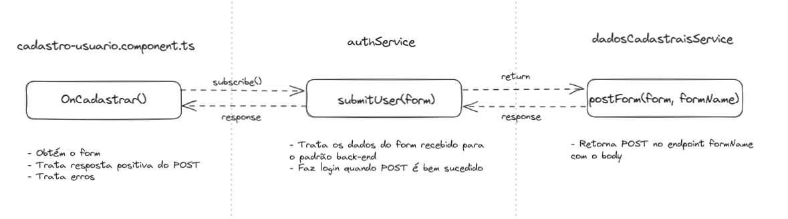

# DOCUMENTAÇÃO DO FRONTEND

## 1. LOGIN

- **Campo de email**
  - Validação do formato de email
- **Campo de senha**
  - Validação se tem 6 caracteres ou mais
- **Link de esqueceu sua senha**
  - Necessário implementar
- **Botão de login**
  - Clicável apenas se todos os campos forem válidos
  - Aciona o evento `onLogin()` do backend
- **Botão de cadastrar**

- **`onLogin()`**
  - Dá subscribe na função `login()` (retorna um Observable) do `authService` que faz o POST no endpoint `/login`
  - Caso o login seja bem sucedido, é recebido o `access_token` na resposta e é salvo no localStorage

## 2. CADASTRO DO USUÁRIO

- **Nome Completo**
  - String obrigatória
- **CPF/CNPJ**
  - String (para considerar 0's à esquerda) obrigatória
  - Máscara do campo (se houver 11 ou menos caracteres é CPF, senão é CNPJ) usando a diretiva CpfCnpjMaskDirective 
  - Validação de tamanho mínimo de 11 dígitos
- **Email**
  - String obrigatória
  - Validação do formato de email
- **Senha**
  - String obrigatória
  - Validação de tamanho mínimo de 8 caracteres
  - Validação de senha com o regex para uma letra maiúscula, uma minúscula, um número e um caractere especial
  - Validação de senha para verificar se o campo "Confirmar Senha" é igual
- **Confirmar Senha**
  - String obrigatória
  - Validação de tamanho mínimo de 8 caracteres
  - Validação de senha com o regex para uma letra maiúscula, uma minúscula, um número e um caractere especial
  - Validação de senha para verificar se o campo "Senha" é igual
- **Botão de cadastrar**
  - Clicável apenas se todos os campos forem válidos
  - No submit do formulário, aciona o evento `onCadastrar()`

- **`onCadastrar()`**
  - Dá subscribe na função `submitUser()` (retorna um Observable) do `authService`, que por sua vez retorna o Observable da função `postForm()` do `dados-cadastrais.service` que faz o POST no endpoint `/usuario/` do backend
  - Caso o cadastro seja bem sucedido, é redirecionado para a página de tutorial com o `step` = 1
  - Segue a imagem do fluxo de cadastro:
  - 

NECESSÁRIO CRIAR OS GUARDS
# BANCO DE DADOS
***Explicar os pqs de cada tabela, campo e relação***
* Poderia ter tabela endereço
* relação entre usuario e curador e curatelado importante